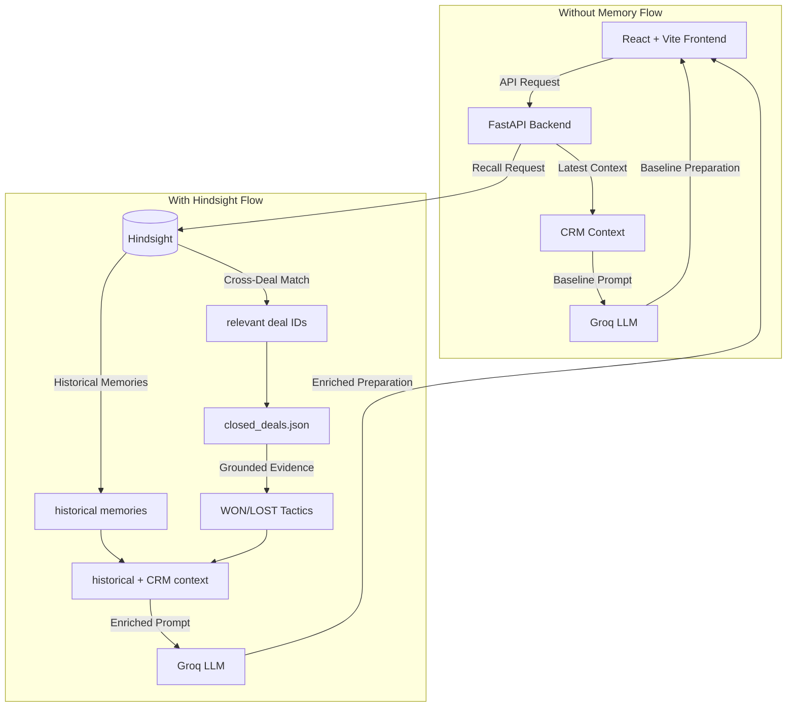

# DealMind AI

Memory-powered sales intelligence for better next-call preparation.

## 1. Problem

Modern CRM context primarily exposes the latest or current information regarding a prospect. While useful, this single-point-in-time view often causes sales representatives to miss important historical changes or contradictory signals that occurred earlier in the deal cycle. 

Consider the **Acme Technologies** scenario (DEAL-001):
- **Value:** $180K deal
- **Stage:** Negotiation stage
- **Historical Memory 1:** Budget was initially stated to *not* be a blocker.
- **Historical Memory 2:** The CTO raised an SAP integration concern.
- **Latest Context:** Budget suddenly became a constraint, leading to a request for scope reduction and a phased implementation. Pricing concerns were heavily emphasized.

Without remembering that the budget was previously open, a rep might treat the current pricing concern at face value rather than recognizing it as a critical reversal in the customer's position.

## 2. Core Idea

DealMind AI demonstrates the value of persistent memory via an explicitly decoupled A/B comparison. The A/B comparison keeps the query and latest CRM context constant; historical memory is the differentiating input.

### Without Memory
- Uses current/latest CRM context only.
- Does NOT call Hindsight.
- Represents the baseline a rep could realistically receive from standard CRM context.

### With Hindsight
- Retrieves historical memories using Hindsight.
- Retrieves relevant cross-deal historical context.
- Combines historical context with the current CRM context.
- Sends the enriched context to the deal-analysis layer.
- Produces a more informed, highly contextualized preparation brief.

## 3. How Hindsight Is Used

DealMind AI utilizes Hindsight as its core memory infrastructure through the following flow:

1. **Retain**
   - Historical sales interactions are retained into Hindsight alongside their deal and call metadata context.
2. **Recall**
   - Deal-specific historical memories are recalled when preparing for the next call.
   - Cross-deal memories are also recalled to identify relevant historical closed deals that faced similar objections.
3. **Analyze**
   - Recalled historical context is combined with the current CRM information.
   - Groq-powered analysis produces structured, actionable deal intelligence.
4. **Ground Similar Deals**
   - Hindsight identifies relevant historical deal IDs.
   - The application then matches those IDs against `data/prospects/closed_deals.json`.
   - Canonical outcome/tactic information comes directly from that seeded dataset.
   - This makes the displayed WON/LOST evidence completely deterministic.

*Note: DealMind grounds recommendations in similar past deals; it does not claim that Hindsight statistically learns winning tactics.*

## 4. Architecture



## 5. Demo Scenario

The memory-enhanced view successfully surfaces a critical historical contradiction spanning three calls:

| Call | Date | Event |
|---|---|---|
| Call 1 | 2026-09-20 | Budget not currently a blocker |
| Call 2 | 2026-09-23 | SAP integration technical concern |
| Call 3 | 2026-09-26 | Budget changed; scope reduction and phased implementation requested |

**The Critical Transition:**
- **Earlier:** Budget was not a blocker.
- **Later:** Budget became a constraint.

DealMind highlights this specific contradiction, allowing the rep to proactively address the sudden shift in purchasing power rather than treating it as a standard negotiation tactic.

## 6. Similar Closed Deals

When Hindsight identifies similar past deals facing the same budget objections, the backend grounds those IDs in known historical outcomes:

| Deal ID | Outcome | Tactic |
|---|---|---|
| DEAL-002 | WON | phased rollout |
| DEAL-003 | LOST | full-price proposal rejected due to budget |

- **DEAL-002** provides a positive example of how to navigate the current objection.
- **DEAL-003** provides a counterexample of what to avoid.
- **DEAL-001** (the current active deal) must never appear as its own historical similar deal.

## 7. Key UI / Demo Features

DealMind AI's interface is designed for immediate rep comprehension:

- **Initial Hindsight locked state:** Hindsight is explicitly triggered by the user rather than automatically contaminating the baseline on load.
- **Prepare for call:** The primary CTA to generate insights.
- **Without Memory baseline:** The default view representing standard CRM capabilities.
- **With Hindsight comparison:** The memory-enriched A/B view.
- **What Changed:** Highlights structural shifts in the prospect's stance.
- **Historical contradiction:** Flags direct conflicts in stakeholder statements.
- **Hindsight memory timeline:** Chronological visualization of the 3 key calls.
- **Recalled memory count:** Displays exactly how many memories (e.g., 23 recalled memories) fed the analysis.
- **Rep Brief:** The ultimate output containing:
  - **Key Situation:** Summarized state of the deal.
  - **Recommended Action:** Strategic next step.
  - **Ask This:** Exact phrasing for the rep to use.
- **Why This Recommendation?:** Displays the WON and LOST similar-deal evidence cleanly justifying the recommendation.

## 8. Tech Stack

**Frontend:**
- React
- Vite
- JavaScript
- CSS

**Backend:**
- Python
- FastAPI
- Pydantic
- Uvicorn

**AI / Memory:**
- Hindsight
- Groq

**Data:**
- JSON demo CRM/prospect data
- `closed_deals.json`

## 9. Project Structure

```
dealmind-ai-hackwithhyderabad/
├── backend/
│   ├── app/
│   │   ├── routes/
│   │   └── services/
│   └── tests/
├── data/
│   └── prospects/
│       └── closed_deals.json
├── frontend/
│   └── src/
└── README.md
```

## 10. Local Setup

**Backend Setup:**
```bash
cd backend
python -m venv venv
# Activate venv (e.g., `.\venv\Scripts\Activate.ps1` on Windows)
pip install -r requirements.txt
# Configure your .env file here
uvicorn app.main:app --reload --port 8000
```

**Frontend Setup:**
```bash
cd frontend
npm install
npm run dev
```
*Note: Vite is configured to proxy `/api` requests to the FastAPI backend running on port 8000.*

## 11. Environment Variables

The backend requires a `.env` file containing the following variables:

```env
HINDSIGHT_API_KEY="your_key"
HINDSIGHT_BASE_URL="https://api.hindsight.com"
HINDSIGHT_BANK_ID="your_bank_id"
GROQ_API_KEY="your_key"
GROQ_MODEL="llama-3.1-70b-versatile"
```

## 12. Testing

The application logic has been validated through automated and manual testing.

**Backend:**
```bash
cd backend
python -m pytest
```

**Frontend:**
```bash
cd frontend
npm run build
```

The API flow was tested separately to guarantee complete isolation between `without_memory` and `with_hindsight` modes. Repeated Hindsight runs were tested extensively to ensure deterministic similar-deal rendering in the frontend.

## 13. Demo Flow

Follow this exact flow when demonstrating DealMind AI to judges:

1. Open DealMind.
2. Show the **Acme Technologies** prospect dashboard.
3. Show that Hindsight is initially locked and waiting for activation.
4. Click **Prepare for call**.
5. Show the **Without Memory** baseline (notice it misses the budget context shift).
6. Select the **With Hindsight** tab.
7. Show **What Changed** to highlight the structural shifts.
8. Show the **historical budget contradiction**.
9. Show the **Hindsight memory timeline** (Calls 1, 2, and 3).
10. Show the **Rep Brief**.
11. Show **DEAL-002 WON** as the tactical justification.
12. Show **DEAL-003 LOST** as the counterexample to avoid.
13. Switch back to **Without Memory**.
14. Explain that historical memory acts as an explicit intelligence layer and does not contaminate the standard baseline.

## 14. Security

- Secrets belong exclusively in `.env`.
- Do not commit API keys to version control.
- Ensure `.env` remains in `.gitignore`.

## 15. Limitations

- **Demo Data:** This demo utilizes seeded CRM and closed-deal JSON data.
- **Prototype Status:** DealMind AI is a prototype intelligence layer, not a production CRM replacement.
- **Grounding vs Prediction:** Similar-deal evidence is retrieval-grounded demo evidence, not statistical sales prediction.
- **Human-in-the-Loop:** AI recommendations are designed to assist, and should always be reviewed by the sales representative before execution.

## 16. Why Memory Matters

past interactions → changed customer position → increased risk → better next action
